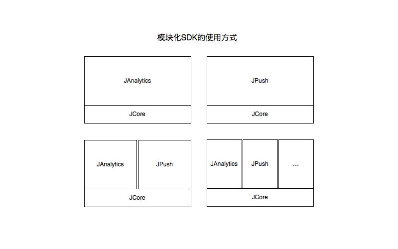

# Cordova Plugin JCore

极光各种开发者服务的核心依赖 JCore SDK 的 Cordova 插件。

极光开发者服务及对应的 Cordova 插件如下：

- 极光推送（JPush）- [jpush-phonegap-plugin](https://github.com/jpush/jpush-phonegap-plugin)
- 极光 IM（JMessage）- [jmessage-phonegap-plugin](https://github.com/jpush/jmessage-phonegap-plugin)
- 极光统计（JAnalytics）- [cordova-plugn-janalytics](https://github.com/wilhantian/cordova-plugin-janalytics)
- 极光短信验证码（JSMS）- [cordova-plugin-jsms](https://github.com/jpush/cordova-plugin-jsms)

## 什么是 JCore

**模块化的极光开发者SDK**

极光开发者服务 SDK 采用了模块化的使用模式，即一个核心（JCore）+ N 种服务（JPush，JMessage...）的使用方式，方便开发者使用某一项服务或多项服务，极大的优化了多模块同时使用时功能模块重复的问题。如下图：

## Install
cordova-plugin-jcore 作为其他极光 Cordova 插件的依赖，在安装其他插件时会自动安装。

## Support
<!-- - [极光社区](http://community.jiguang.cn/) -->
- QQ 交流群：413602425

## License
MIT © [JiGuang](/license)
